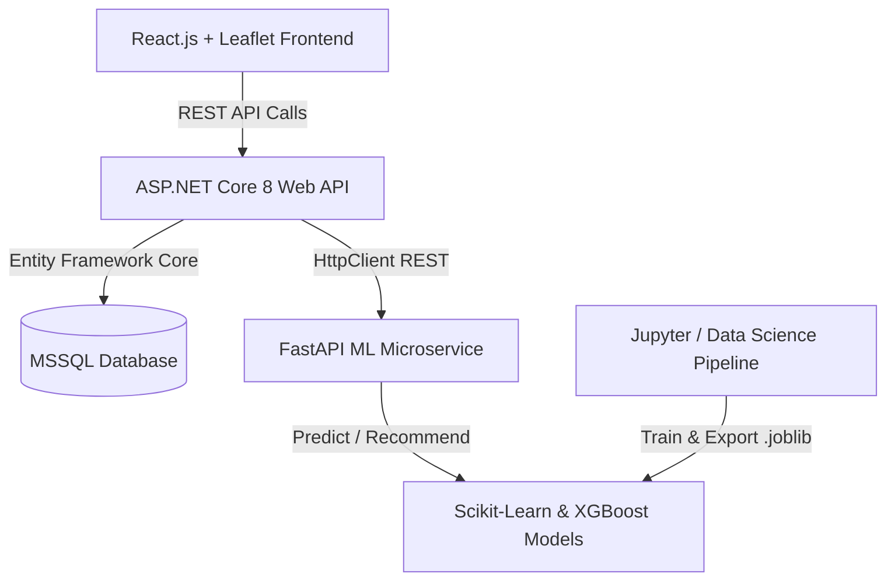

# SmartStay AI 🏨✨
> **Akıllı Konaklama Öneri & Dinamik Fiyat Değerleme Platformu**

SmartStay AI; kullanıcıların bütçe, lokasyon ve olanak tercihlerine (Wi-Fi, klima, havuz, ev tipi vb.) göre en uygun konaklama ilanlarını öneren ve seçilen ilanın fiyatını bölge/özellik ortalamasına göre **"Fırsat"**, **"Piyasa Değerinde"** veya **"Pahalı"** olarak makine öğrenmesiyle tespit eden modern, tam yığın (full-stack) bir web platformudur.

---

## 📌 Proje Mimarisi ve Ana Modüller

Platform, modern bir mikroservis ve çok katmanlı mimari yaklaşımıyla 4 ana bileşenden oluşmaktadır:



### 1. 🤖 Akıllı Öneri Motoru (Recommendation Engine)
- **Teknoloji:** TF-IDF (Term Frequency-Inverse Document Frequency) + Cosine Similarity
- **İşlev:** Kullanıcının serbest metin veya filtreler ile girdiği tercihler ile konaklama ilanlarının özellikleri, açıklamaları ve olanakları (amenities) vektör uzayında karşılaştırılarak benzerlik skoru en yüksek ilanlar listelenir.

### 2. 📊 Dinamik Fiyat Değerleme Motoru (Valuation Engine)
- **Teknoloji:** XGBoost & Random Forest Regressor
- **İşlev:** İlanın oda tipi, coğrafi konumu (enlem/boylam), mahalle, olanaklar, yorum sayısı ve puanlarına göre olması gereken tahmini piyasa fiyatını hesaplar. Gerçek fiyat ile tahmin edilen fiyat kıyaslanarak kullanıcıya dinamik değerleme rozetleri sunulur:
  - 🟢 **Fırsat:** Piyasa değerinin altında (%10+ indirimli)
  - 🔵 **Piyasa Değerinde:** Piyasa ortalamasında (+/-%10)
  - 🔴 **Pahalı:** Piyasa değerinin üzerinde (%10+ pahalı)

---

## 🛠️ Teknoloji Yığını

| Katman | Teknolojiler |
|---|---|
| **Veri Bilimi & ML** | Python 3.14, Pandas, NumPy, Scikit-Learn, XGBoost, Matplotlib, Seaborn, Joblib, Jupyter |
| **ML Servis Katmanı** | FastAPI, Uvicorn, Pydantic |
| **Ana Backend** | ASP.NET Core 8 Web API, C#, Entity Framework Core, MSSQL Server |
| **Frontend** | React.js, Tailwind CSS, Leaflet.js, React-Leaflet, Axios, Lucide Icons |
| **Versiyon Kontrol** | Git, Monorepo Mimarisi |

---

## 📂 Proje Klasör Yapısı

```text
SmartStay-AI
├── data_science/               # Veri bilimi, keşifçi veri analizi ve modelleme
│   ├── data/
│   │   ├── raw/                # Ham veri seti (listings.csv)
│   │   └── processed/          # Temizlenmiş ve işlenmiş veri seti
│   ├── notebooks/              # Jupyter analiz ve model geliştirme defterleri
│   │   ├── 01_eda_and_cleaning.ipynb
│   │   ├── 02_recommender_system.ipynb
│   │   └── 03_price_prediction_model.ipynb
│   └── models/                 # Eğitilmiş modeller ve vektörleştiriciler (.joblib)
├── ml_service/                 # FastAPI tabanlı ML mikroservisi
│   ├── app/
│   │   ├── main.py             # FastAPI giriş noktası
│   │   ├── schemas.py          # Pydantic veri modelleri
│   │   └── services/           # Model yükleme ve tahmin servisleri
│   └── requirements.txt
├── backend/                    # ASP.NET Core 8 Web API (Çok Katmanlı Mimari)
│   ├── SmartStay.API/          # Controllers, Middlewares, Dependency Injection
│   ├── SmartStay.Core/         # Entities, DTOs, Interfaces
│   ├── SmartStay.Data/         # DbContext, Migrations, Repositories
│   └── SmartStay.Services/     # Business Logic, ML Client Service
├── frontend/                   # React + Tailwind + Leaflet Arayüzü
│   ├── src/
│   │   ├── components/         # Kartlar, Filtreler, Harita, Modal bileşenleri
│   │   ├── pages/              # Ana Sayfa, Arama/Sonuç, İlan Detay
│   │   └── services/           # Backend API istemcileri (Axios)
│   └── package.json
└── README.md
```

---

## 📊 Veri Seti Bilgisi

Projede **Inside Airbnb** açık veri setinden elde edilen `listings.csv` verisi kullanılmaktadır.
- **Kritik Kolonlar:** `id`, `name`, `description`, `neighbourhood_cleansed`, `latitude`, `longitude`, `room_type`, `accommodates`, `bathrooms`, `bedrooms`, `beds`, `amenities`, `price`, `number_of_reviews`, `review_scores_rating`.

---

## 🚀 Kurulum ve Başlangıç

### 1. Veri Bilimi & ML Ortamı
```bash
# Sanal ortamı aktive edin
.venv\Scripts\activate

# Bağımlılıkları yükleyin
pip install -r requirements.txt

# Jupyter Notebook'u başlatın
jupyter notebook
```

### 2. FastAPI ML Servisi
```bash
cd ml_service
uvicorn app.main:app --reload --port 8000
```

### 3. Backend (ASP.NET Core)
```bash
cd backend/SmartStay.API
dotnet run
```

### 4. Frontend (React)
```bash
cd frontend
npm install
npm start
```

---

## 📅 Geliştirme Yol Haritası

- **Aşama 1 (Veri Bilimi & ML):** Keşifçi Veri Analizi (EDA), Veri Temizleme, TF-IDF Öneri Motoru, XGBoost Fiyat Tahmin Modeli ve Model Kaydı (`.joblib`).
- **Aşama 2 (FastAPI ML Servisi):** REST endpoint'leri (`/predict`, `/recommend`), Pydantic şemaları ve CORS yapılandırması.
- **Aşama 3 (ASP.NET Core Backend):** EF Core Code-First veritabanı, Repository Pattern, N-Tier Mimari, HttpClient ML entegrasyonu.
- **Aşama 4 (React Frontend & Harita):** Dinamik filtreleme, Leaflet interaktif harita, Fırsat/Piyasa/Pahalı rozetleri ve UI/UX geliştirmeleri.
